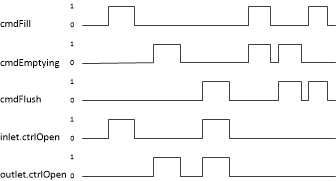
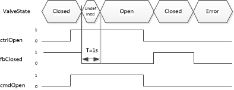

<!-- .slide: data-background="rgb(0,0,40)" -->
<!-- .slide: class="centered has-dark-background" -->

<h2>Learning path</h2>
<h1>SIMATIC AX</h1>
<h3>Introduction to ST Programming</h3>
---

  

    <header class="slide_header">
      <h2>Prerequisites</h2>
    </header>
  

  

    
<strong>Target Audience:</strong> Automation engineers transitioning from TIA Portal to SIMATIC AX

    <ul>
      <li><strong>Required Experience:</strong> Solid SCL programming knowledge in TIA Portal</li>
      <li><strong>Familiar with:</strong> Function blocks, data types, program organization in Step 7</li>
      <li><strong>SIMATIC AX Basics:</strong> Basic understanding of SIMATIC AX development environment</li>
      <li><strong>Development Setup:</strong> SIMATIC AX installed and configured for development</li>
      <li><strong>Background:</strong> Industrial automation, PLC programming, Siemens ecosystem</li>
    </ul>
    
<strong>What you'll gain:</strong> Advanced ST programming concepts, professional code organization, and hands-on automation project experience

  

  

    
<strong>Essential Prerequisites:</strong>

    

      <strong>Important:</strong> Basic SIMATIC AX knowledge is mandatory to successfully complete this training
    

    <ul>
      <li><strong>SIMATIC AX Environment:</strong> Know how to create and navigate projects</li>
      <li><strong>APAX CLI:</strong> Understand basic package manager commands</li>
      <li><strong>Code Editor:</strong> Familiar with ST syntax highlighting and basic editing</li>
      <li><strong>Build & Deploy:</strong> Understand compilation and deployment process</li>
    </ul>
    
<strong>Recommended Preparation:</strong>

    <ul>
      <li>Complete SIMATIC AX Getting Started tutorials</li>
      <li>Practice basic project creation and building</li>
      <li>Familiarize yourself with the development workflow</li>
    </ul>
  

---

  

    <header class="slide_header">
      <h2>Learning Objectives</h2>
    </header>
  

  

    
<strong>After completing this training, you will be able to:</strong>

    <ul>
      <li><strong>Analyze:</strong> Compare ST program structure vs. TIA Portal approach (15 min)</li>
      <li><strong>Create:</strong> Build CONFIGURATION with tasks, global variables, and I/O mapping (30 min)</li>
      <li><strong>Implement:</strong> Write FUNCTION, FUNCTION_BLOCK, and PROGRAM units with proper interfaces (45 min)</li>
      <li><strong>Organize:</strong> Structure code using namespaces and access modifiers (20 min)</li>
      <li><strong>Design:</strong> Define custom data types, enumerations for type-safe programming (25 min)</li>
      <li><strong>Apply:</strong> Build a complete tank control application with valve function blocks (60 min)</li>
    </ul>
    

      <strong>Total Duration:</strong> ~3 hours | <strong>Assessment:</strong> Hands-on tank application project
    

  

  

    
<strong>Learning Path Structure:</strong>

    <ol>
      <li><strong>Foundation:</strong> ST Program Architecture & Configuration</li>
      <li><strong>Core Concepts:</strong> Program Organization Units (POUs)</li>
      <li><strong>Organization:</strong> Namespaces & Code Structure</li>
      <li><strong>Data Types:</strong> Custom Types & Enumerations</li>
      <li><strong>Practice:</strong> Hands-On Tank Application</li>
      <li><strong>Advanced:</strong> Reflection & Next Steps</li>
    </ol>
    
<strong>Prerequisites Verified:</strong> ✓ SCL Programming ✓ TIA Portal ✓ Function Blocks ✓ SIMATIC AX Basics

  

---

  

    <header class="slide_header">
      <h2>Chapter 1 - Learning Goals</h2>
    </header>
  

  

    
<strong>ST Program Architecture & Configuration (45 minutes)</strong>

    
<strong>You will learn to:</strong>

    <ul>
      <li><strong>Identify:</strong> Key differences between TIA Portal and SIMATIC AX project structure</li>
      <li><strong>Explain:</strong> The role of CONFIGURATION, TASK, and PROGRAM elements</li>
      <li><strong>Create:</strong> A basic CONFIGURATION with global variables and I/O mapping</li>
      <li><strong>Configure:</strong> Tasks with different execution modes (cyclic, interrupt)</li>
    </ul>
    

      <strong>Assessment:</strong> Create a working CONFIGURATION with at least 2 tasks and 5 global variables
    

  

  

    
<strong>Topics Covered:</strong>

    <ul>
      <li>ST Program Structure Overview</li>
      <li>Configuration & Tasks</li>
      <li>Global Variables & I/O Mapping</li>
      <li>Program Organization</li>
    </ul>
    
<strong>Key Outcomes:</strong>

    <ul>
      <li>Understanding of text-based project configuration</li>
      <li>Ability to set up basic automation project structure</li>
      <li>Knowledge of variable scopes and I/O handling</li>
    </ul>
  

---

  

    <header class="slide_header">
      <h2>ST Program</h2>
    </header>
  

  

    
<strong>ST Program Architecture in SIMATIC AX:</strong>

    <ul>
      <li><strong>CONFIGURATION:</strong> Central project definition (replaces TIA Portal's device configuration)</li>
      <li><strong>TASK(s):</strong> Execution scheduling with precise timing control</li>
      <li><strong>Program Organization Units (POUs):</strong> PROGRAM, FUNCTION, FUNCTION_BLOCK</li>
      <li><strong>Global Variables:</strong> Centralized variable and I/O declaration</li>
    </ul>
    

      <strong>Key Difference from TIA Portal:</strong> In SIMATIC AX, everything is declared explicitly in text-based ST code, providing full transparency and version control compatibility
    

    
<strong>Minimum Requirements:</strong> Every ST application needs at least one <code>CONFIGURATION</code> and one <code>PROGRAM</code>

  

  

    
<strong>TIA Portal vs. SIMATIC AX:</strong>

    <table>
      <tr><th>Aspect</th><th>TIA Portal</th><th>SIMATIC AX</th></tr>
      <tr><td>Block Interface</td><td>Graphical block interface</td><td>Textual block interface</td></tr>
      <tr><td>Program Structure</td><td>Organization blocks (OB)</td><td>PROGRAM and CONFIGURATION</td></tr>
      <tr><td>Global Data</td><td>Data blocks (DB)</td><td>VAR_GLOBAL</td></tr>
    </table>
  

---

  

    <header class="slide_header">
      <h2>Configuration & Tasks</h2>
    </header>
  

  

    
<strong>The CONFIGURATION section is the foundation of every SIMATIC AX project:</strong>

    <ul>
      <li><strong>Purpose:</strong> Defines the complete application structure and resources</li>
      <li><strong>Hardware Abstraction:</strong> Separates software logic from hardware implementation</li>
      <li><strong>Central Declaration:</strong> Single point for all global elements</li>
    </ul>
    

      <strong>Key Benefit:</strong> Unlike TIA Portal's distributed configuration, SIMATIC AX centralizes everything in transparent, version-controllable text
    

  

  

    
<strong>What a CONFIGURATION contains:</strong>

    <ul>
      <li><strong>Tasks:</strong> Execution scheduling with timing and priority</li>
      <li><strong>Programs:</strong> Assignment of programs to tasks</li>
      <li><strong>Global Variables:</strong> System-wide accessible variables and instances</li>
      <li><strong>I/O Mapping:</strong> Hardware address assignments (AT %I0.0, %Q0.1, etc.)</li>
      <li><strong>Constants:</strong> Global constant values</li>
    </ul>
  

---

  

    <header class="slide_header">
      <h2>Task Configuration</h2>
    </header>
  

  

    
<strong>Task Configuration defines execution timing and program assignment:</strong>

    <pre><code class="language-plaintext">
CONFIGURATION PLC_1
    TASK Main(Interval := T#10ms, Priority := 1);
    PROGRAM P1 WITH Main : ExampleProgram;
END_CONFIGURATION
    </code></pre>
    
<strong>Key Elements:</strong>

    <ul>
      <li><strong>TASK Main:</strong> Defines a cyclic task named "Main"</li>
      <li><strong>Interval := T#10ms:</strong> Task executes every 10 milliseconds</li>
      <li><strong>Priority := 1:</strong> High priority execution</li>
    </ul>
  

  

    
<strong>Program Assignment and Execution:</strong>

    <ul>
      <li><strong>PROGRAM P1 WITH Main:</strong> Assigns program "P1" to task "Main"</li>
      <li><strong>ExampleProgram:</strong> The actual program implementation</li>
      <li><strong>Execution Flow:</strong> Every 10ms, the runtime calls ExampleProgram</li>
    </ul>
    

      <strong>Difference from TIA Portal:</strong> In SIMATIC AX, task configuration is explicit and text-based, providing clear visibility of timing and assignment
    

    
<strong>Common Task Types:</strong>

    <ul>
      <li>Cyclic tasks (T#10ms, T#100ms)</li>
      <li>Event-driven tasks</li>
      <li>Background tasks</li>
    </ul>
  

---

  

    <header class="slide_header">
      <h2>Global Variables</h2>
    </header>
  

  

    
<strong>Global Variables in SIMATIC AX provide system-wide data access:</strong>

    <ul>
      <li><strong>Accessibility:</strong> Available from any part of the program</li>
      <li><strong>Scope:</strong> Declared outside of functions and blocks</li>
      <li><strong>Purpose:</strong> Share data between different program parts</li>
      <li><strong>Persistence:</strong> Maintain values across program cycles</li>
    </ul>
    

      <strong>Replacement for TIA Portal:</strong> VAR_GLOBAL sections replace Data Blocks (DB) for global data management
    

  

  

    
<strong>Declaration structure within CONFIGURATION:</strong>

    <pre><code class="language-plaintext">
CONFIGURATION PLC_1
    VAR_GLOBAL
        // Global variables and instances
    END_VAR
    VAR_GLOBAL CONSTANT
        // Global constants
    END_VAR
END_CONFIGURATION
    </code></pre>
    
<strong>Variable Types in VAR_GLOBAL:</strong>

    <ul>
      <li><strong>Variables:</strong> Standard data types (INT, BOOL, REAL, etc.)</li>
      <li><strong>Instances:</strong> Function block or class instances</li>
      <li><strong>I/O Mapping:</strong> Hardware addresses (AT %I0.0, %Q0.1)</li>
      <li><strong>Constants:</strong> Read-only values (VAR_GLOBAL CONSTANT)</li>
    </ul>
  

---

  

    <header class="slide_header">
      <h2>Example: Configuration & Global Variables</h2>
    </header>
  

  

    
<strong>Example Overview - Different Variable Types:</strong>

    <table>
      <tr><th>Type</th><th>Example</th><th>Description</th></tr>
      <tr><td>Variable</td><td>cycleCount : INT;</td><td>Simple counter variable</td></tr>
      <tr><td>Instance</td><td>v1 : Valve;</td><td>Function block instance</td></tr>
      <tr><td>Digital Input</td><td>v1isClosed AT %I0.1 : BOOL;</td><td>Hardware input mapping</td></tr>
      <tr><td>Digital Output</td><td>v1ctrlOpen AT %Q0.0 : BOOL;</td><td>Hardware output mapping</td></tr>
    </table>
    
<strong>Key Benefits:</strong>

    <ul>
      <li>Centralized global data management</li>
      <li>Clear hardware I/O mapping</li>
      <li>Explicit instance declarations</li>
    </ul>
  

  

    
<strong>Complete CONFIGURATION Example:</strong>

    <pre><code class="language-plaintext">
CONFIGURATION PLC_1
    VAR_GLOBAL // Variables and Instances
        v1ctrlOpen AT %Q0.0 : BOOL;  // digital output
        v1isClosed AT %I0.0 : BOOL;  // digital input
        v2ctrlOpen AT %Q0.1 : BOOL;  // digital output
        v2isClosed AT %I0.1 : BOOL;  // digital input
        v1 : Valve; // instance of Valve FB
        v2 : Valve; 
        t1 : Tank := (volume := REAL#100.0); // with init
    END_VAR
    VAR_GLOBAL // Additional variables
        cycleCount : INT; // global counter
    END_VAR
    VAR_GLOBAL CONSTANT // Constants
        PI : REAL := REAL#3.141592;
    END_VAR
END_CONFIGURATION
    </code></pre>
  

---

  

    <header class="slide_header">
      <h2>Program</h2>
    </header>
  

  

    
<strong>PROGRAM is the main execution unit in SIMATIC AX:</strong>

    <ul>
      <li><strong>Purpose:</strong> Defines program logic, variables, and execution code</li>
      <li><strong>Modularization:</strong> Enables structured program organization</li>
      <li><strong>Variable Scopes:</strong> Multiple variable sections with different lifetimes</li>
      <li><strong>Execution:</strong> Called by tasks with defined timing</li>
    </ul>
    

      <strong>Key Difference:</strong> Unlike TIA Portal's OBs, SIMATIC AX programs have explicit variable sections and clear scope definitions
    

  

  

    
<strong>PROGRAM Structure and Variable Sections:</strong>

    <pre><code class="language-plaintext">
PROGRAM ExampleProgram
    VAR_EXTERNAL    
        // Global variables/instances from configuration
    END_VAR
    VAR
        // Program local variables/instances (static)
    END_VAR
    VAR_TEMP
        // Temporary variables (reset each cycle)
    END_VAR
    ; // program code goes here
END_PROGRAM
    </code></pre>
    
<strong>Important Notes:</strong>

    <ul>
      <li><strong>VAR_EXTERNAL:</strong> Import global variables</li>
      <li><strong>VAR:</strong> Static program-local variables</li>
      <li><strong>VAR_TEMP:</strong> No FB/Class instances allowed</li>
    </ul>
  

---

  

    <header class="slide_header">
      <h2>Example: Program</h2>
    </header>
  

  

    
<strong>Practical PROGRAM Example with Variable Import:</strong>

    <pre><code class="language-plaintext">
PROGRAM ExampleProgram
    VAR_EXTERNAL
        v1ctrlOpen : BOOL;  // Import global output
        v1isClosed : BOOL;  // Import global input
        v2ctrlOpen : BOOL;  // Import global output
        v2isClosed : BOOL;  // Import global input
        v1 : Valve;         // Import global instance
        v2 : Valve;         // Import global instance
        t1 : Tank;          // Import global instance
    END_VAR    
    ; // Program logic would go here
END_PROGRAM
    </code></pre>
  

  

    
<strong>Understanding VAR_EXTERNAL:</strong>

    <ul>
      <li><strong>Purpose:</strong> Import global variables into program scope</li>
      <li><strong>Source:</strong> Variables declared in CONFIGURATION VAR_GLOBAL</li>
      <li><strong>Access:</strong> Enables direct use of global resources</li>
      <li><strong>Benefit:</strong> Clear dependency declaration</li>
    </ul>
    
<strong>Variable Mapping:</strong>

    <ul>
      <li><strong>v1ctrlOpen, v2ctrlOpen:</strong> Digital outputs</li>
      <li><strong>v1isClosed, v2isClosed:</strong> Digital inputs</li>
      <li><strong>v1, v2:</strong> Valve function block instances</li>
      <li><strong>t1:</strong> Tank function block instance</li>
    </ul>
    

      <strong>Best Practice:</strong> Always import only the global variables you actually need in the program
    

  

---

  

    <header class="slide_header">
      <h2>Functions</h2>
    </header>
  

  

    
<strong>FUNCTION characteristics in SIMATIC AX:</strong>

    <ul>
      <li><strong>Stateless:</strong> Does not store state between calls</li>
      <li><strong>Return Value:</strong> Can optionally return a value</li>
      <li><strong>Reusable:</strong> Can be called multiple times</li>
      <li><strong>Pure Logic:</strong> Input processing without side effects</li>
    </ul>
    

      <strong>Best Practice:</strong> Use functions for calculations and data transformations without persistent state requirements
    

  

  

    
<strong>FUNCTION Variable Sections:</strong>

    <table>
      <tr><th>Section</th><th>Purpose</th></tr>
      <tr><td>VAR_INPUT</td><td>Input parameters</td></tr>
      <tr><td>VAR_OUTPUT</td><td>Output parameters</td></tr>
      <tr><td>VAR_IN_OUT</td><td>Reference parameters</td></tr>
      <tr><td>VAR_TEMP</td><td>Temporary local variables</td></tr>
      <tr><td>VAR_EXTERNAL</td><td>Access to global variables</td></tr>
      <tr><td>VAR CONSTANT</td><td>Local constants</td></tr>
    </table>
    
<strong>Key Features:</strong>

    <ul>
      <li><strong>Input/Output:</strong> Clear parameter interface</li>
      <li><strong>Global Access:</strong> Via VAR_EXTERNAL</li>
      <li><strong>Local Scope:</strong> VAR_TEMP for calculations</li>
    </ul>
  

---

  

    <header class="slide_header">
      <h2>Example: Function and Program</h2>
    </header>
  

  

    
<strong>Circle Area Calculation Function:</strong>

    <pre><code class="language-plaintext">
FUNCTION Area : LREAL
    VAR_INPUT
        diameter : LREAL;
    END_VAR
    VAR_EXTERNAL CONSTANT
        PI : REAL;
    END_VAR
    Area := diameter ** 2.0 * PI / 4.0; // (d²*PI)/4
END_FUNCTION
    </code></pre>
    
<strong>Function Features:</strong>

    <ul>
      <li><strong>Return Type:</strong> LREAL (double precision)</li>
      <li><strong>Input Parameter:</strong> diameter as LREAL</li>
      <li><strong>Global Constant:</strong> Access to PI via VAR_EXTERNAL</li>
      <li><strong>Calculation:</strong> Standard circle area formula</li>
    </ul>
  

  

    
<strong>Function Usage in PROGRAM:</strong>

    <pre><code class="language-plaintext">
PROGRAM ExampleProgram
    VAR_TEMP
        result : LREAL;
    END_VAR
    result := Area(diameter := 2.0); 
    ;
END_PROGRAM
    </code></pre>
    
<strong>Discussion Question:</strong>

    
<em>What needs to be done to calculate the area of a square?</em>

    
<strong>Solutions:</strong>

    <ul>
      <li>Rename functions: CircleArea and SquareArea</li>
      <li><strong>Better approach:</strong> Use Namespaces for organization</li>
    </ul>
    

      <strong>Next Topic:</strong> Namespaces solve the naming conflict problem elegantly
    

  

---

  

    <header class="slide_header">
      <h2>Function Overloading: By Data Type</h2>
    </header>
  

  

    
<strong>Function Overloading allows multiple functions with the same name but different parameter types:</strong>

    <pre><code class="language-plaintext">
FUNCTION ADD: INT
    VAR_INPUT
        a: INT;
        b: INT;
    END_VAR
    ADD := a + b;
END_FUNCTION

FUNCTION ADD: LREAL
    VAR_INPUT
        a: LREAL;
        b: LREAL;
    END_VAR
    ADD := a + b;
END_FUNCTION
    </code></pre>
  

  

    
<strong>How It Works:</strong>

    <ul>
      <li><strong>Same Name:</strong> Both functions are called "ADD"</li>
      <li><strong>Different Types:</strong> One for INT, one for LREAL</li>
      <li><strong>Compiler Resolution:</strong> Automatically selects correct function based on parameter types</li>
      <li><strong>Type Safety:</strong> Prevents incorrect type operations at compile time</li>
    </ul>
    
<strong>Usage Examples:</strong>

    <pre><code class="language-plaintext">
result1 := ADD(5, 3);        // Calls INT version
result2 := ADD(5.5, 3.2);    // Calls LREAL version
    </code></pre>
    

      <strong>Key Benefit:</strong> Clean, intuitive function names without type suffixes (no AddInt, AddReal needed)
    

  

---

  

    <header class="slide_header">
      <h2>Function Overloading: By Parameter Count</h2>
    </header>
  

  

    
<strong>Functions can also be overloaded by different number of parameters (signature):</strong>

    <pre><code class="language-plaintext">
FUNCTION ADD: LREAL
    VAR_INPUT
        a: LREAL;
        b: LREAL;
    END_VAR
    ADD := a + b;
END_FUNCTION

FUNCTION ADD: LREAL
    VAR_INPUT
        a: LREAL;
        b: LREAL;
        c: LREAL;
    END_VAR
    ADD := ADD(a, b) + c;  // Calls 2-parameter version
END_FUNCTION
    </code></pre>
  

  

    
<strong>Benefits for TIA Portal Users:</strong>

    <ul>
      <li><strong>Revolutionary Feature:</strong> Not available in TIA Portal SCL</li>
      <li><strong>Clean Code:</strong> No need for different function names</li>
      <li><strong>Maintainability:</strong> Consistent naming across different signatures</li>
      <li><strong>Flexibility:</strong> Same logic, different parameter combinations</li>
    </ul>
    
<strong>Usage Examples:</strong>

    <pre><code class="language-plaintext">
result1 := ADD(1.0, 2.0);           // 2 parameters
result2 := ADD(1.0, 2.0, 3.0);     // 3 parameters
    </code></pre>
    

      <strong>Revolutionary Impact:</strong> Function overloading provides unprecedented flexibility compared to traditional SCL programming
    

  

---

  

    <header class="slide_header">
      <h2>Function Block</h2>
    </header>
  

  

    
<strong>FUNCTION_BLOCK characteristics:</strong>

    <ul>
      <li><strong>Stateful:</strong> Persists state across multiple cycles</li>
      <li><strong>Modular:</strong> Program organization unit for complex logic</li>
      <li><strong>Instance-based:</strong> Multiple instances with separate states</li>
      <li><strong>Encapsulation:</strong> Internal variables hidden from external access</li>
    </ul>
    

      <strong>Key Difference from FUNCTION:</strong> FUNCTION_BLOCK maintains its internal state between calls, making it ideal for continuous control tasks
    

  

  

    
<strong>Comparison: FUNCTION vs FUNCTION_BLOCK</strong>

    <table>
      <tr><th>Aspect</th><th>FUNCTION</th><th>FUNCTION_BLOCK</th></tr>
      <tr><td>State</td><td>Stateless</td><td>Stateful</td></tr>
      <tr><td>Usage</td><td>Calculations</td><td>Control logic</td></tr>
      <tr><td>Instances</td><td>Direct call</td><td>Must instantiate</td></tr>
      <tr><td>Memory</td><td>No persistent data</td><td>Persistent variables</td></tr>
    </table>
    
<strong>Typical Use Cases:</strong>

    <ul>
      <li><strong>Control Systems:</strong> Valves, motors, pumps</li>
      <li><strong>State Machines:</strong> Process sequencing</li>
      <li><strong>Regulation:</strong> PID controllers</li>
      <li><strong>Communication:</strong> Protocol handlers</li>
    </ul>
  

---

  

    <header class="slide_header">
      <h2>Structure of Function Block</h2>
    </header>
  

  

    
<strong>FUNCTION_BLOCK Variable Sections:</strong>

    <table>
      <tr><th>Section</th><th>Purpose</th><th>Accessibility</th></tr>
      <tr><td>VAR</td><td>Static internal variables</td><td>Internal only</td></tr>
      <tr><td>VAR_INPUT</td><td>Input parameters</td><td>External → Internal</td></tr>
      <tr><td>VAR_OUTPUT</td><td>Output parameters</td><td>Internal → External</td></tr>
      <tr><td>VAR_IN_OUT</td><td>Reference parameters</td><td>Bidirectional</td></tr>
      <tr><td>VAR_TEMP</td><td>Temporary variables</td><td>Internal, reset each cycle</td></tr>
      <tr><td>VAR_EXTERNAL</td><td>Global variable access</td><td>Global → Internal</td></tr>
    </table>
  

  

    
<strong>Variable Section Details:</strong>

    <ul>
      <li><strong>VAR (Static):</strong> Core state variables, not accessible externally</li>
      <li><strong>VAR_INPUT:</strong> Parameters passed when calling the function block</li>
      <li><strong>VAR_OUTPUT:</strong> Results provided back to caller</li>
      <li><strong>VAR_IN_OUT:</strong> Direct reference to external variables</li>
      <li><strong>VAR_TEMP:</strong> Temporary calculations, reset each execution</li>
      <li><strong>VAR_EXTERNAL:</strong> Import global variables/constants</li>
    </ul>
    

      <strong>Encapsulation Principle:</strong> VAR section provides private data storage, while INPUT/OUTPUT define the public interface
    

  

---

  

    <header class="slide_header">
      <h2>Function Block Access Modifiers</h2>
    </header>
  

  

    
<strong>Access Modifiers control variable visibility in FUNCTION_BLOCK:</strong>

    <table>
      <tr><th>Modifier</th><th>Visibility</th><th>Usage</th></tr>
      <tr><td>PRIVATE</td><td>Only within this FB</td><td>Internal implementation details</td></tr>
      <tr><td>PROTECTED</td><td>This FB + derived classes</td><td>Inheritance scenarios</td></tr>
      <tr><td>PUBLIC</td><td>External access allowed</td><td>External interface</td></tr>
    </table>
    
<strong>Default Access Level:</strong>

    <ul>
      <li><strong>VAR section:</strong> PROTECTED by default</li>
      <li><strong>Best Practice:</strong> Explicitly declare access levels</li>
      <li><strong>Encapsulation:</strong> Use PRIVATE for internal state</li>
    </ul>
  

  

    
<strong>Access Modifier Syntax Examples:</strong>

    <pre><code class="language-plaintext">
FUNCTION_BLOCK Valve
    VAR_INPUT
        cmdOpen : BOOL;
    END_VAR
    VAR_OUTPUT
        isOpen : BOOL;
    END_VAR
    VAR PRIVATE
        internalState : INT;        // Only within this FB
        debugCounter : INT;
    END_VAR
    VAR PROTECTED
        baseValue : REAL;           // Inheritable
    END_VAR
    VAR PUBLIC
        status : STRING;            // Externally accessible
    END_VAR
END_FUNCTION_BLOCK
    </code></pre>
    

      <strong>Design Principle:</strong> Use the most restrictive access level possible - prefer PRIVATE over PROTECTED over PUBLIC
    

  

---

  

    <header class="slide_header">
      <h2>Example</h2>
    </header>
  

  

    
<strong>Simple Valve Function Block Example:</strong>

    <pre><code class="language-plaintext">
FUNCTION_BLOCK Valve
    VAR_INPUT
        cmdOpen : BOOL;         // Command to open valve
    END_VAR
    VAR_OUTPUT
        ctrlOpen : BOOL;        // Control signal to actuator
        isOpen : BOOL;          // Valve is open feedback
        isClosed : BOOL;        // Valve is closed feedback
    END_VAR
    VAR PRIVATE
        internalTimer : OnDelay;    // Internal timing logic
    END_VAR
    // Implementation logic would go here
    ;
END_FUNCTION_BLOCK
    </code></pre>
  

  

    
<strong>Function Block Interface Analysis:</strong>

    <ul>
      <li><strong>VAR_INPUT:</strong> cmdOpen - External command interface</li>
      <li><strong>VAR_OUTPUT:</strong> Control and status signals for external use</li>
      <li><strong>VAR PRIVATE:</strong> Internal timer not accessible externally</li>
    </ul>
    
<strong>Design Benefits:</strong>

    <ul>
      <li><strong>Clear Interface:</strong> Defined inputs and outputs</li>
      <li><strong>Encapsulation:</strong> Private internal variables</li>
      <li><strong>Reusability:</strong> Multiple instances possible</li>
    </ul>
    

      <strong>Real-world Application:</strong> This valve FB can control pneumatic, hydraulic, or electric actuators with consistent interface
    

  

---

  

    <header class="slide_header">
      <h2>Usage of Function Block</h2>
    </header>
  

  

    
<strong>Function Block Instance Usage:</strong>

    <pre><code class="language-plaintext">
PROGRAM ExampleProgram
    VAR
        v2 : Valve;             // Program local instance
    END_VAR
    VAR_EXTERNAL              // Import global variables/instances
        v1 : Valve;
        v1ctrlOpen : BOOL;
        v1isClosed : BOOL; 
    END_VAR
    
    // Call function block instances
    v1();                     // Call global instance
    v2();                     // Call program local instance
END_PROGRAM
    </code></pre>
  

  

    
<strong>Instance Types and Usage:</strong>

    <ul>
      <li><strong>Global Instance (v1):</strong> Declared in CONFIGURATION, shared across programs</li>
      <li><strong>Local Instance (v2):</strong> Declared in PROGRAM, only accessible within this program</li>
    </ul>
    
<strong>Function Block Calling:</strong>

    <ul>
      <li><strong>v1():</strong> Executes the global valve instance</li>
      <li><strong>v2():</strong> Executes the local valve instance</li>
      <li><strong>State Persistence:</strong> Each instance maintains its own state</li>
    </ul>
    

      <strong>Best Practice:</strong> Use global instances for hardware-related FBs and local instances for calculation or temporary logic
    

  

---

  

    <header class="slide_header">
      <h2>Chapter 3 - Learning Goals</h2>
    </header>
  

  

    
<strong>Namespaces & Code Organization (30 minutes)</strong>

    
<strong>You will learn to:</strong>

    <ul>
      <li><strong>Explain:</strong> How namespaces solve naming conflicts and organize code</li>
      <li><strong>Create:</strong> Namespaces with functions, types, and nested structures</li>
      <li><strong>Implement:</strong> USING directives for clean code access</li>
      <li><strong>Resolve:</strong> Naming conflicts with fully qualified names</li>
    </ul>
    

      <strong>Practice Goal:</strong> Organize valve and tank logic in separate namespaces
    

  

  

    
<strong>Topics Covered:</strong>

    <ul>
      <li>Namespace Declaration & Syntax</li>
      <li>USING Directives</li>
      <li>Naming Conflict Resolution</li>
      <li>Hierarchical Organization</li>
    </ul>
    
<strong>Real-world Benefits:</strong>

    <ul>
      <li>Cleaner, more maintainable code</li>
      <li>Better team collaboration</li>
      <li>Reduced naming conflicts</li>
    </ul>
  

---

  

    <header class="slide_header">
      <h2>Namespaces</h2>
    </header>
  

  

    
<strong>Namespaces in SIMATIC AX provide code organization and scope isolation:</strong>

    <ul>
      <li><strong>Purpose:</strong> Combine language elements into logical groups</li>
      <li><strong>Structure:</strong> Create separate scopes to avoid naming conflicts</li>
      <li><strong>Scope Isolation:</strong> Elements in different namespaces don't interfere</li>
      <li><strong>Global Namespace:</strong> Elements without explicit namespace belong to global scope</li>
    </ul>
    

      <strong>Key Benefit:</strong> Namespaces solve the naming conflict problem demonstrated in the Area function example
    

  

  

    
<strong>Additional Resources:</strong>

    <ul>
      <li><strong>Documentation:</strong> <a href="https://console.simatic-ax.siemens.io/docs/st/language/program-structure/namespaces#declaring-a-namespace">SIMATIC AX Namespaces Guide</a></li>
      <li><strong>Best Practices:</strong> Use meaningful namespace names reflecting functionality</li>
      <li><strong>Organization:</strong> Group related functions, types, and classes together</li>
    </ul>
    
<strong>Namespace Contents:</strong>

    <ul>
      <li>Nested namespaces</li>
      <li>Functions and function blocks</li>
      <li>Classes and methods</li>
      <li>Custom data types</li>
    </ul>
  

---
<section data-auto-animate="">
  <h2>Declaration of Namespaces</h2>
  

    

      
<strong>Namespace Declaration Syntax and Contents:</strong>

      <pre><code class="language-plaintext">
NAMESPACE Vehicle
    // namespace content
END_NAMESPACE
      </code></pre>
      
<strong>A namespace may contain:</strong>

      <ul>
        <li><strong>Nested Namespaces:</strong> Namespaces can be nested for hierarchical organization</li>
        <li><strong>Functions:</strong> Reusable code blocks with input/output parameters</li>
        <li><strong>Classes:</strong> Object-oriented programming structures</li>
        <li><strong>Types:</strong> Custom data type definitions</li>
      </ul>
    

    

      
<strong>Organization Benefits:</strong>

      <ul>
        <li><strong>Logical Grouping:</strong> Related functionality organized together</li>
        <li><strong>Name Collision Prevention:</strong> Same names in different namespaces</li>
        <li><strong>Code Reusability:</strong> Easy import and usage across projects</li>
        <li><strong>Maintainability:</strong> Clear structure for large codebases</li>
      </ul>
      

        <strong>Key Principle:</strong> Namespaces provide scope isolation and prevent naming conflicts while maintaining code organization
      

    

  

</section>
---
<section data-auto-animate="">
  <h2>Example Namespaces</h2>
  

    

      
<strong>Circle Namespace with Area Function:</strong>

      <pre><code class="language-plaintext">
NAMESPACE Circle
    FUNCTION Area : LREAL
        VAR_INPUT
            diameter : LREAL;
        END_VAR
        VAR_EXTERNAL CONSTANT
            PI : REAL;
        END_VAR
        Area := diameter ** 2.0 * PI / 4.0;
    END_FUNCTION    
END_NAMESPACE
      </code></pre>
      
<strong>Formula Explanation:</strong> Circle area = (d²×π)/4

    

    

      
<strong>Square Namespace with Area Function:</strong>

      <pre><code class="language-plaintext">
NAMESPACE Square
    FUNCTION Area : LREAL
        VAR_INPUT
            sideLength : LREAL;
        END_VAR
        Area := sideLength ** 2.0;
    END_FUNCTION    
END_NAMESPACE
      </code></pre>
      
<strong>Formula Explanation:</strong> Square area = side²

      

        <strong>Key Benefit:</strong> Both namespaces can have an "Area" function without naming conflicts
      

    

  

</section>
---
<section data-auto-animate="">
  <h2>Using Namespaces</h2>
  

    

      
<strong>Method 1: Fully Qualified Calls</strong>

      <pre><code class="language-plaintext">
PROGRAM ExampleProgram
    VAR_TEMP
        result : LREAL;
    END_VAR
    result := Circle.Area(diameter := 2.0);
    result := Square.Area(sideLength := 2.0);
END_PROGRAM
      </code></pre>
      
<strong>Advantages:</strong>

      <ul>
        <li>Clear which namespace is being used</li>
        <li>No import statements required</li>
        <li>Explicit and unambiguous</li>
      </ul>
    

    

      
<strong>Method 2: Using USING Directive</strong>

      <pre><code class="language-plaintext">
USING Circle;
PROGRAM ExampleProgram
    VAR_TEMP
        result : LREAL;
    END_VAR
    result := Area(diameter := 2.0);
END_PROGRAM
      </code></pre>
      
<strong>Advantages:</strong>

      <ul>
        <li>Shorter function calls</li>
        <li>Cleaner code appearance</li>
        <li>Similar to import statements in other languages</li>
      </ul>
      

        <strong>Question:</strong> What happens if you want to call Square.Area() with USING Circle?
      

    

  

</section>
---
<section data-auto-animate="">
  <h2>Solution: Multiple USING Directives</h2>
  

    

      
<strong>Using Multiple Namespaces:</strong>

      <pre><code class="language-plaintext">
USING Circle;
USING Square;
PROGRAM ExampleProgram
    VAR_TEMP
        result : LREAL;
    END_VAR
    result := Area(diameter := 2.0);
    result := Area(sideLength := 2.0);
END_PROGRAM
      </code></pre>
      
<strong>Key Points:</strong>

      <ul>
        <li>Multiple USING statements allowed</li>
        <li>Both functions accessible without qualification</li>
        <li>Parameter names help distinguish calls</li>
      </ul>
    

    

      
<strong>Why Does This Work?</strong>

      <ul>
        <li><strong>Function Overloading:</strong> Different parameter signatures distinguish functions</li>
        <li><strong>Parameter Names:</strong> `diameter` vs `sideLength` make calls unambiguous</li>
        <li><strong>Compiler Resolution:</strong> Compiler matches calls to correct function based on parameters</li>
        <li><strong>Type Safety:</strong> Ensures correct function is called at compile time</li>
      </ul>
      

        <strong>Best Practice:</strong> Use descriptive parameter names to avoid ambiguity when importing multiple namespaces
      

    

  

</section>
---
---

  

    <header class="slide_header">
      <h2>Hands On Exercises</h2>
    </header>
  

  

    
<strong>Practical Tank Application:</strong>

    
In the following exercises, you will build a small tank application consisting of:

    <ul>
      <li><strong>Inlet Valve:</strong> Controls fluid flow into the tank</li>
      <li><strong>Outlet Valve:</strong> Controls fluid flow out of the tank</li>
      <li><strong>Tank:</strong> Main container with integrated valve control</li>
    </ul>
    

      <strong>Learning Objective:</strong> Apply function block concepts, namespaces, and SIMATIC AX project structure in a real-world automation scenario
    

  

  

    
<strong>System Overview:</strong>

    
    
<strong>Exercises Structure:</strong>

    <ul>
      <li><strong>ST01:</strong> Create Valve Function Block</li>
      <li><strong>ST02:</strong> Create Tank Function Block</li>
      <li><strong>ST03:</strong> Integration and Testing</li>
    </ul>
  

---

  

    <header class="slide_header">
      <h2>Hands On (ST01): Valve Function Block</h2>
    </header>
  

  

    
<strong>Exercise ST01 - Function Block 'Valve':</strong>

    <ol>
      <li><strong>Project Setup:</strong> <code class="language-plaintext">apax create app [projectname]</code></li>
      <li><strong>Namespace:</strong> Use 'Fluidhandling' namespace</li>
      <li><strong>Implementation:</strong> Create Valve FB with interface</li>
      <li><strong>Global Instance:</strong> Declare in VAR_GLOBAL</li>
      <li><strong>Testing:</strong> Deploy and test cmdOpen behavior</li>
    </ol>
    

      <strong>Goal:</strong> Function block creation and namespace usage
    

  

  

    
<strong>Valve Interface Specification:</strong>

    
    <table style="font-size: 0.8em;">
      <tr><th>Parameter</th><th>Section</th><th>Type</th></tr>
      <tr><td>cmdOpen</td><td>INPUT</td><td>BOOL</td></tr>
      <tr><td>ctrlOpen</td><td>OUTPUT</td><td>BOOL</td></tr>
      <tr><td>isClosed</td><td>OUTPUT</td><td>BOOL</td></tr>
      <tr><td>isOpen</td><td>OUTPUT</td><td>BOOL</td></tr>
    </table>
  

  

    
<strong>Valve Behavior:</strong>

    
  

  

    

      <strong>Implementation Tip:</strong> Use the valve interface and behavior diagram to guide your implementation
    

  

---

  

    <header class="slide_header">
      <h2>Hands On (ST02): Tank Function Block</h2>
    </header>
  

  

    
<strong>Exercise ST02 - Tank Function Block:</strong>

    
Create a Tank FB that integrates inlet and outlet valves:

    <ul>
      <li><strong>Inlet Valve:</strong> Controls fluid inflow</li>
      <li><strong>Outlet Valve:</strong> Controls fluid outflow</li>
      <li><strong>Tank Logic:</strong> Coordinates valve operations</li>
      <li><strong>State Management:</strong> Fill, Empty, Flush modes</li>
    </ul>
  

  

    
<strong>Tank Interface:</strong>

    
  

  

    
<strong>Tank Behavior:</strong>

    
  

  

    

      <strong>Key Concept:</strong> Function block composition - using valves within tank FB
    

  

---

  

    <header class="slide_header">
      <h2>Hands On (ST03): Integration and Testing</h2>
    </header>
  

  

    
<strong>Exercise ST03 - System Integration:</strong>

    <ol>
      <li><strong>Global Instances:</strong> Create instances of tank and valves in VAR_GLOBAL section</li>
      <li><strong>Program Integration:</strong> Call all instances in a PROGRAM</li>
      <li><strong>Deployment:</strong> Download the program to a PLC</li>
      <li><strong>Testing:</strong> Modify tank variables (Fill, Emptying, Flush)</li>
      <li><strong>Monitoring:</strong> Watch valve status (isOpen/isClosed) in real-time</li>
    </ol>
    

      <strong>Real-world Application:</strong> This exercise simulates actual industrial tank control scenarios
    

  

  

    
<strong>Testing Checklist:</strong>

    <ul>
      <li><strong>Fill Operation:</strong> Inlet valve opens, outlet valve closes</li>
      <li><strong>Empty Operation:</strong> Inlet valve closes, outlet valve opens</li>
      <li><strong>Flush Operation:</strong> Both valves open for cleaning cycle</li>
      <li><strong>Safety States:</strong> Verify proper valve interlocking</li>
    </ul>
    
<strong>Learning Outcomes:</strong>

    <ul>
      <li>Function block composition and reusability</li>
      <li>Global instance management</li>
      <li>Real-time monitoring and debugging</li>
    </ul>
  

---

  

    <header class="slide_header">
      <h2>Chapter 4 - Learning Goals</h2>
    </header>
  

  

    
<strong>Custom Data Types & Enumerations (40 minutes)</strong>

    
<strong>You will learn to:</strong>

    <ul>
      <li><strong>Define:</strong> Custom enumerations for type-safe state management</li>
      <li><strong>Compare:</strong> Enumerations vs. named value types and their use cases</li>
      <li><strong>Implement:</strong> ValveState enum for enhanced valve control</li>
      <li><strong>Evaluate:</strong> Type safety benefits and debugging considerations</li>
    </ul>
    

      <strong>Application Goal:</strong> Replace BOOL valve states with ValveState enum
    

  

  

    
<strong>Topics Covered:</strong>

    <ul>
      <li>Data Type Fundamentals</li>
      <li>Enumeration Declaration & Usage</li>
      <li>Named Value Types</li>
      <li>Type Safety Best Practices</li>
    </ul>
    
<strong>Practical Benefits:</strong>

    <ul>
      <li>Improved code readability</li>
      <li>Enhanced type safety</li>
      <li>Better debugging capabilities</li>
      <li>Self-documenting code</li>
    </ul>
  

---
<section data-auto-animate="">
  <h2>Types</h2>
  

    

      
<strong>Data Types in Structured Text:</strong>

      <ul>
        <li><strong>Purpose:</strong> Specify how memory addresses are interpreted</li>
        <li><strong>Memory Definition:</strong> Determine how many bytes are covered by a variable</li>
        <li><strong>Interpretation Rules:</strong> Define how the data should be processed</li>
        <li><strong>Type Safety:</strong> Prevent incorrect data operations at compile time</li>
      </ul>
      

        <strong>Key Concept:</strong> A data type specifies how a memory address (variable name) is interpreted
      

    

    

      
<strong>Categories of Data Types:</strong>

      <ul>
        <li><strong>Predefined Types:</strong> Built into the ST language (INT, REAL, BOOL, etc.)</li>
        <li><strong>User-Defined Types:</strong> Custom types created for specific applications</li>
        <li><strong>Structured Types:</strong> Complex data structures combining multiple elements</li>
        <li><strong>Enumeration Types:</strong> Named constant values for improved readability</li>
      </ul>
      
<strong>Focus:</strong> This section covers user-defined data types that enhance code clarity and maintainability

    

  

</section>
---
<section data-auto-animate="">
  <h2>Enumeration</h2>
  

    

      
<strong>Enumeration Definition:</strong>

      
An enumeration is a data type defined by a set of named, constant values.

      <pre><code class="language-plaintext">
NAMESPACE Siemens.Ax.Training
    TYPE
        ValveState : ( Open, Undefined, Closed, Error) := Undefined;
    END_TYPE
END_NAMESPACE
      </code></pre>
      
<strong>Result:</strong> This declares the type `ValveState` and four constant values: UNDEFINED, OPEN, CLOSED, and ERROR.

    

    

      
<strong>Key Characteristics:</strong>

      <ul>
        <li><strong>Type Safety:</strong> Compiler ensures only defined values are used</li>
        <li><strong>Default Value:</strong> Can be specified during declaration (here: Undefined)</li>
        <li><strong>Fallback Rule:</strong> If no default specified, first value becomes default</li>
        <li><strong>Closed Type:</strong> Runtime values are guaranteed to be one of the defined constants</li>
      </ul>
      

        <strong>Advantage:</strong> Enumeration provides type-safe, readable alternatives to magic numbers
      

    

  

</section>
---
<section data-auto-animate="">
  <h2>Data Type with Named Values</h2>
  

    

      
<strong>Named Values Definition:</strong>

      
Similar to enumeration, but assigns specific values to named constants of a certain type.

      <pre><code class="language-plaintext">
NAMESPACE Siemens.Ax.Training
    TYPE
        TankState : INT (Filling := 1, 
                        Emptying := 2, 
                        Stop := 3) := Empty;
    END_TYPE
END_NAMESPACE
      </code></pre>
      
<strong>Result:</strong> Declares type `TankState` with three named constants having specific INT values.

    

    

      
<strong>Key Characteristics:</strong>

      <ul>
        <li><strong>Explicit Values:</strong> Each constant has a specific numeric value</li>
        <li><strong>Base Type:</strong> Built on existing data type (here: INT)</li>
        <li><strong>Value Access:</strong> Can be used like constants of the base type</li>
        <li><strong>Default Handling:</strong> If no default specified, first named value becomes default</li>
      </ul>
      
<strong>Usage Example:</strong>

      <pre><code class="language-plaintext">
VAR
    currentState : TankState := TankState#Filling;
END_VAR
      </code></pre>
      

        <strong>Note:</strong> Data types with named values don't provide the same type safety advantages as enumerations
      

    

  

</section>
---
<section data-auto-animate="">
  <h2>Enumerations vs Data Type with Named Values</h2>
  

    

      
<strong>Enumeration Advantages:</strong>

      <ul>
        <li><strong>Type Safety:</strong> Strong type checking prevents invalid values</li>
        <li><strong>Closed System:</strong> Only defined values are allowed</li>
        <li><strong>Compiler Protection:</strong> Prevents assignment of arbitrary values</li>
        <li><strong>Self-Documenting:</strong> Clear intent and limited value range</li>
      </ul>
      

        <strong>Recommendation:</strong> Use enumerations when you need strict type safety and limited value sets
      

    

    

      
<strong>Named Values Characteristics:</strong>

      <ul>
        <li><strong>Flexibility:</strong> Can be used like constants of the base type</li>
        <li><strong>Interoperability:</strong> Compatible with operations on base type</li>
        <li><strong>Less Protection:</strong> Doesn't provide same type safety as enumerations</li>
        <li><strong>Legacy Compatibility:</strong> Easier integration with existing numeric systems</li>
      </ul>
      
<strong>Key Insight:</strong> Data types with named values do not provide the same advantage over symbolic constants as enumerations do.

    

  

</section>
---

  

    <header class="slide_header">
      <h2>Hands On (ST04): Advanced Valve</h2>
    </header>
  

  

    
<strong>Exercise ST04 - ValveWithClosedSensor:</strong>

    
Implement a new valve type with enhanced feedback:

    <ul>
      <li><strong>Closed Sensor:</strong> Feedback signal for closed state</li>
      <li><strong>Enum States:</strong> Replace BOOL outputs with ValveState enum</li>
      <li><strong>Refactor Original:</strong> Update existing Valve to use enum</li>
    </ul>
    

      <strong>Learning Goal:</strong> Enumerations for type-safe state management
    

  

  

    
<strong>Enhanced Interface:</strong>

    
  

  

    
<strong>Timing Behavior:</strong>

    
  

  

    

      <strong>Implementation Tip:</strong> Define ValveState enum with UNKNOWN, OPEN, CLOSED states
    

  

---

  

    <header class="slide_header">
      <h2>Hands On (ST05): Tank Integration</h2>
    </header>
  

  

    
<strong>Exercise ST05 - Enhanced Tank System:</strong>

    <ol>
      <li><strong>New Tank Type:</strong> Create tank using ValveWithClosedSensor</li>
      <li><strong>Program Integration:</strong> Call instances in PROGRAM</li>
      <li><strong>PLC Deployment:</strong> Download and test on hardware</li>
      <li><strong>State Testing:</strong> Test Fill, Emptying, Flush modes</li>
      <li><strong>Monitor States:</strong> Watch valve enum states during operation</li>
    </ol>
  

  

    
<strong>Testing Scenarios:</strong>

    <ul>
      <li><strong>Fill Mode:</strong> Monitor inlet/outlet valve states</li>
      <li><strong>Empty Mode:</strong> Verify proper valve coordination</li>
      <li><strong>Flush Mode:</strong> Check simultaneous valve operation</li>
      <li><strong>State Feedback:</strong> Observe enhanced sensor feedback</li>
    </ul>
    

      <strong>Real-world Benefit:</strong> Enhanced diagnostics and safety through better state visibility
    

  

---

  

    <header class="slide_header">
      <h2>Reflection Questions</h2>
    </header>
  

  

    
<strong>Which problems have you recognized?</strong>

    <ul>
      <li><strong>Enum Monitoring:</strong> Enums cannot be monitored directly in current tools</li>
      <li><strong>Type Compatibility:</strong> Cannot simply exchange valve types</li>
      <li><strong>Tank Variants:</strong> Need separate tank for each valve configuration</li>
      <li><strong>Maintenance Overhead:</strong> Multiple similar implementations required</li>
    </ul>
  

  

    
<strong>Looking Ahead:</strong>

    

      <strong>Future Solution:</strong> Object-oriented programming (OOP) will provide mechanisms to solve these problems elegantly through inheritance and polymorphism
    

    
<strong>Current Limitations:</strong>

    <ul>
      <li>Limited code reusability between valve types</li>
      <li>Manual type management required</li>
      <li>Debugging challenges with enum states</li>
    </ul>
  

---

  

    <header class="slide_header">
      <h2>Chapter 5 - Learning Goals</h2>
    </header>
  

  

    
<strong>System Functions & Libraries (45 minutes)</strong>

    
<strong>You will learn to:</strong>

    <ul>
      <li><strong>Explore:</strong> Available system functions and their applications</li>
      <li><strong>Install:</strong> System libraries using apax package manager</li>
      <li><strong>Implement:</strong> Timer functions for enhanced valve control</li>
      <li><strong>Manage:</strong> Library dependencies in apax.yml configuration</li>
    </ul>
    

      <strong>Advanced Project:</strong> Build ValveClosedSensorMon with OnDelay timer functionality
    

  

  

    
<strong>Topics Covered:</strong>

    <ul>
      <li>System Function Overview</li>
      <li>Library Installation & Management</li>
      <li>Timer Functions (OnDelay, OffDelay)</li>
      <li>Error State Management</li>
    </ul>
    
<strong>Real-world Skills:</strong>

    <ul>
      <li>Professional library management</li>
      <li>Advanced valve diagnostics</li>
      <li>Robust error handling</li>
    </ul>
  

---

  

    <header class="slide_header">
      <h2>System Functions</h2>
    </header>
  

  

    
<strong>Target-Specific System Functions in SIMATIC AX:</strong>

    
SIMATIC AX provides access to powerful system functions for various automation tasks:

    <ul>
      <li><strong>Timer Functions:</strong> OnDelay, OffDelay for time-based control</li>
      <li><strong>Math Functions:</strong> Abs, Sin, Exp, Sqrt for calculations</li>
      <li><strong>Bit Functions:</strong> GetBit, SetBit for bit manipulation</li>
      <li><strong>Communication:</strong> Connect, TcpSend for network operations</li>
    </ul>
    

      <strong>Advantage:</strong> These functions are optimized for industrial automation and provide reliable, tested functionality
    

  

  

    
<strong>Example of available Library Categories:</strong>

    <ul>
      <li><strong>System.Timer:</strong> Time delay and pulse functions</li>
      <li><strong>System.Math:</strong> Mathematical operations and functions</li>
      <li><strong>System.Strings:</strong> String manipulation utilities</li>
    </ul>
    
<strong>Documentation Resources:</strong>

    <ul>
      <li><a href="https://console.simatic-ax.siemens.io/docs/libraries/simatic-1500">SIMATIC-1500 Libraries</a></li>
      <li><a href="https://console.simatic-ax.siemens.io/docs/libraries/system">System Libraries</a></li>
    </ul>
  

---

  

    <header class="slide_header">
      <h2>How to Use System Libraries</h2>
    </header>
  

  

    
<strong>Installing System.Timer Library:</strong>

    
<strong>Step 1: Add Library Dependency</strong>

    <pre><code class="language-plaintext">
apax add @ax/system-timer
    </code></pre>
    
<strong>Step 2: Import in Your Code</strong>

    <pre><code class="language-plaintext">
USING System.Timer;

FUNCTION_BLOCK ValveWithDelay
    VAR
        delayTimer : OnDelay;
    END_VAR
    // Implementation...
END_FUNCTION_BLOCK
    </code></pre>
  

  

    
<strong>Library Management Best Practices:</strong>

    <ul>
      <li><strong>Version Control:</strong> Specify exact versions in apax.yml</li>
      <li><strong>Documentation:</strong> Always check library documentation</li>
      <li><strong>Testing:</strong> Validate library functions in your application</li>
    </ul>
    
<strong>Further Information:</strong>

    <ul>
      <li><a href="https://console.simatic-ax.siemens.io/docs/libraries/system-timer">System.Timer Documentation</a></li>
    </ul>
    

      <strong>Pro Tip:</strong> Use apax.lock to ensure consistent library versions across team deployments
    

  

---

  

    <header class="slide_header">
      <h2>Library Dependencies Management</h2>
    </header>
  

  

    
<strong>Dependencies in apax.yml:</strong>

    
The dependencies section defines which libraries should be installed:

    <pre><code class="language-plaintext">
dependencies:
  "@ax/system-timer": ^0.3.26
  "@ax/system-math": ^1.2.0
    </code></pre>
    
<strong>Version Syntax:</strong>

    <ul>
      <li><strong>^0.3.26:</strong> Compatible version (allows minor updates)</li>
      <li><strong>~0.3.26:</strong> Patch-level changes only</li>
      <li><strong>0.3.26:</strong> Exact version</li>
    </ul>
  

  

    
<strong>Verification with apax.lock:</strong>

    
The apax.lock file shows the actual installed versions:

    <pre><code class="language-plaintext">
{
  "dependencies": {
    "@ax/system-timer": "0.3.26",
    "@ax/system-math": "1.2.3"
  }
}
    </code></pre>
    

      <strong>Important:</strong> Always check apax.lock to verify that libraries are actually installed. The apax.yml only specifies desired dependencies.
    

  

---

  

    <header class="slide_header">
      <h2>Hands On (ST06): Advanced Valve with Timer</h2>
    </header>
  

  

    
<strong>Exercise ST06 - ValveClosedSensorMon:</strong>

    
Extend the ValveFbClosed with enhanced monitoring:

    <ul>
      <li><strong>Timer Integration:</strong> Use OnDelay from System.Timer</li>
      <li><strong>Delayed Opening:</strong> 1-second delay when fbClosed becomes false</li>
      <li><strong>Undefined State:</strong> During delay phase, valve state is undefined</li>
      <li><strong>Error Detection:</strong> If fbClosed is false without cmdOpen → Error state</li>
    </ul>
  

  

    
<strong>Enhanced Valve Interface:</strong>

    
  

  

    
<strong>Extended ValveState Enum:</strong>

    <pre><code class="language-plaintext">
TYPE ValveState : 
    (UNKNOWN, OPEN, CLOSED, 
     UNDEFINED, ERROR);
END_TYPE
    </code></pre>
  

  

    
<strong>Timing Behavior:</strong>

    
  

---

  

    <header class="slide_header">
      <h2>References</h2>
    </header>
  

  

    
<strong>SIMATIC AX Documentation:</strong>

    <ul>
      <li><strong>ST Language Reference:</strong> <a href="https://console.simatic-ax.siemens.io/docs/st/language">ST Language Documentation</a></li>
      <li><strong>Namespaces Guide:</strong> <a href="https://console.simatic-ax.siemens.io/docs/st/language/program-structure/namespaces">Namespaces Documentation</a></li>
      <li><strong>System Libraries:</strong> <a href="https://console.simatic-ax.siemens.io/docs/libraries/system">System Libraries Overview</a></li>
    </ul>
  

  

    
<strong>Additional Resources:</strong>

    <ul>
      <li><strong>SIMATIC-1500 Libraries:</strong> <a href="https://console.simatic-ax.siemens.io/docs/libraries/simatic-1500">Hardware-Specific Functions</a></li>
      <li><strong>APAX Package Manager:</strong> Package management and dependency handling</li>
      <li><strong>Community Support:</strong> Forums and community resources for SIMATIC AX</li>
    </ul>
    

      <strong>Next Steps:</strong> Continue with advanced topics like OOP, interfaces, and complex automation patterns
    

  

---
<section data-auto-animate="">
  <h2>What Did You Learn?</h2>
  

    

      
<strong>Core SIMATIC AX Foundations:</strong>

      <ul>
        <li><strong>Configuration & Tasks:</strong> Text-based project structure and execution control</li>
        <li><strong>Program Organization Units (POUs):</strong> Functions, function blocks, and programs with proper encapsulation</li>
        <li><strong>Namespaces:</strong> Code organization, scope isolation, and conflict resolution</li>
        <li><strong>Custom Data Types:</strong> Type-safe enumerations and named value types</li>
        <li><strong>System Functions:</strong> Professional library management and timer integration</li>
      </ul>
    

    

      
<strong>Professional Skills Gained:</strong>

      <ul>
        <li><strong>Access Modifiers:</strong> PRIVATE, PROTECTED, PUBLIC for secure encapsulation</li>
        <li><strong>Function Overloading:</strong> Type-based and signature-based implementations</li>
        <li><strong>Library Management:</strong> APAX package manager and dependency handling</li>
        <li><strong>Practical Application:</strong> Complete tank control system with advanced valve diagnostics</li>
        <li><strong>Modern Development:</strong> Version control-friendly, text-based automation programming</li>
      </ul>
    

  

</section>

---

  

    <header class="slide_header">
      <h2>Your Learning Journey Summary</h2>
    </header>
  

  

    
<strong>Hands-On Projects Completed:</strong>

    <ul>
      <li><strong>ST01-03:</strong> Basic Tank Application with Valve Function Blocks</li>
      <li><strong>ST04-05:</strong> Enhanced Valves with Enumerations and State Management</li>
      <li><strong>ST06:</strong> Advanced Timer-based Valve Control with Error Handling</li>
    </ul>
    
<strong>Key Achievements:</strong>

    <ul>
      <li>Built a complete industrial automation application</li>
      <li>Mastered modern ST programming paradigms</li>
      <li>Applied professional development practices</li>
    </ul>
  

  

    
<strong>Ready for Next Level:</strong>

    <ul>
      <li><strong>Object-Oriented Programming:</strong> Inheritance, polymorphism, interfaces</li>
      <li><strong>Advanced Patterns:</strong> State machines, design patterns, architecture</li>
      <li><strong>Integration:</strong> HMI connectivity, cloud integration, Industry 4.0</li>
      <li><strong>Team Development:</strong> Collaborative workflows, CI/CD, testing</li>
    </ul>
    

      <strong>Your Foundation:</strong> You now have solid ST programming skills and understand modern automation development with SIMATIC AX
    

  

---
<!-- .slide: data-background="rgb(0,0,40)" -->
<!-- .slide: class="centered has-dark-background" -->

<h2>Thanks for using the</h2>
<h1>SIMATIC AX</h1>
<h2>learning path</h2>
<h4>Introduction to ST Programming</h4>
